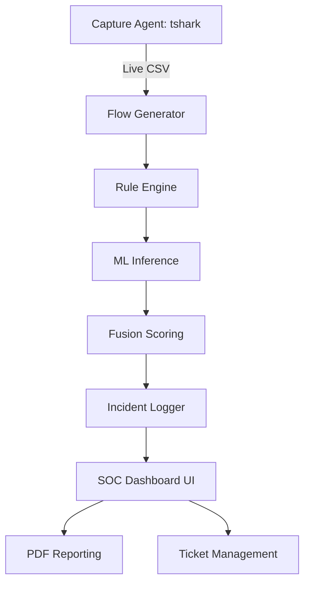

# 🛡️ IoT IDS + SOC Dashboard: Comprehensive Project Handbook

## 📌 Document Overview
This document provides an exhaustive, deep-dive explanation of the **IoT Intrusion Detection System (IDS) and Security Operations Center (SOC) Dashboard**. It covers the technical architecture, machine learning logic, pipeline orchestration, and the premium visualization features implemented in Version 1.1.0.

---

## 1. Executive Summary
The **IoT IDS SOC Dashboard** is a multi-layered security framework designed to detect, analyze, and manage threats in IoT network environments. Unlike traditional IDS which focus solely on detection, this project integrates a complete **Security Operations Center (SOC)** workflow, allowing for real-time monitoring, asset identification, and professional incident reporting.

### Core Value Proposition
- **High-Fidelity Detection**: Combines ML classifiers with heuristic rule-engines.
- **Visual Intelligence**: Interactive network graphs and system health monitors.
- **Operational Efficiency**: Automated ticket generation and PDF report exports.

---

## 2. Technical Architecture

### 2.1 The Multi-Layered Defense Model
The project is structured into five distinct "Levels" of maturity and detection capability:

1.  **Level 1: Dataset Validation (Offline)**
    *   Uses the **TON_IoT** dataset (UNSW).
    *   Validates ML model performance against benchmarked attack data.
2.  **Level 2: Live Packet Inspection (Real-Time)**
    *   Ingests raw traffic from Kali Linux via `tshark`.
    *   Classifies individual packets as `NORMAL` or `SUSPICIOUS`.
3.  **Level 3: Flow Reconstruction**
    *   Groups packets into "Flows" based on 5-tuple keys.
    *   Extracts behavioral metrics (Packets-per-second, unique ports, duration).
4.  **Level 4: Fusion Scoring Engine**
    *   Merges ML confidence scores with rule-based threat assessments.
    *   Calculates a final **Threat Probability Score (0-100)**.
5.  **Level 5: Advanced Threat Categorization**
    *   Specialized signatures for complex attacks: `DNS_TUNNELING`, `BOTNET_C2`, `BRUTEFORCE`.

### 2.2 System Components Diagram (Mermaid)

---

## 3. Machine Learning Logic

### 3.1 Model Stack
The project utilizes a ensemble of **Random Forest** classifiers, chosen for their resilience to noise and speed in inference:
-   **Packet-Level Model** (`live_ids_model.pkl`): Features include IP header fields and frame lengths.
-   **Flow-Level Model** (`flow_ids_model.pkl`): Features include flow duration, byte counts, and packet rates.

### 3.2 Feature Engineering
The **Flow Generator** (`src/flow_generator.py`) is the brain of the feature extraction. It calculates:
-   `packets_per_sec`: Density of traffic.
-   `unique_dst_ports`: Indicator of port scanning.
-   `bytes_per_packet`: Payload size analysis.

---

## 4. SOC Premium Features (New in v1.1.0)

### 4.1 Interactive Network Traffic Graph
Using `streamlit-agraph`, the dashboard now visualizes the network topology:
-   **Nodes**: Represent IP addresses (Green = Source, Blue = Destination).
-   **Edges**: Represent traffic flows.
-   **Color Coding**: Edges turn Red if the **Fusion Score** exceeds 85 (Critical).

### 4.2 System Health Monitoring
Integration with `psutil` allows SOC analysts to monitor the hardware overhead:
-   **CPU Usage**: Real-time percentage tracking.
-   **RAM Usage**: Memory footprint of the ingestion pipeline.
-   Ensures the system does not become a bottleneck during large-scale captures.

### 4.3 Automated PDF Reporting
The `src/generate_pdf_report.py` script uses **ReportLab** to create C-level summaries:
-   **Incidents Table**: Lists top high-severity attacks.
-   **Executive Summary**: High-level metrics for management.
-   **PDF Metadata**: Timestamped and signed for audit compliance.

---

## 5. Security & Operation

### 5.1 Pipeline Orchestration
The pipeline is launched via `src/run_flow_soc_pipeline.py`. It executes the following sequence:
1.  **Ingestion**: Copy `live_capture.csv` from VMware shared folders.
2.  **Cleaning**: Sanitize IP addresses and handle missing values.
3.  **Prediction**: Run ML models on new flows.
4.  **Labeling**: Apply Advanced Rule sets (Level 5).
5.  **Fusion**: Weight the ML and Rule results.
6.  **Ticketing**: Update `soc_tickets.csv` with unique keys to prevent alert fatigue.

### 5.2 Incident Management (The SOC Workflow)
When a threat is detected:
1.  A **P1/P2/P3 Ticket** is auto-generated.
2.  Analysts can select the ticket in the **Dashboard Update Panel**.
3.  Status is tracked: `OPEN` -> `INVESTIGATING` -> `RESOLVED`.
4.  Notes are added for historical audit trails.

---

## 6. Implementation Manifest (File-by-File)

| File Path | Description | Key Tech |
| :--- | :--- | :--- |
| `app/dashboard.py` | Main entry point for the UI | Streamlit, agraph, psutil |
| `src/flow_generator.py` | Packet-to-Flow conversion | Pandas |
| `src/apply_flow_fusion.py` | Scoring logic | NumPy |
| `src/soc_ticket_generator.py` | Automation logic | CSV Logger |
| `src/generate_pdf_report.py` | Reporting engine | ReportLab |

---

## 7. Setup & Deployment Guide

### Kali Linux (Sensor Node)
Deploy the capture command (found in README) to send data to the shared folder.

### Windows (Analyst Node)
1.  Run `.\run_dashboard.ps1`.
2.  Monitor Tab 4 for the Network Graph.
3.  Generation a report at the end of each shift.

---

## 8. Conclusion
The **IoT IDS SOC Dashboard** represents a significant step forward in making network security monitoring accessible yet powerful. By combining raw mathematical analysis (ML) with human-centric visualization and operational workflows, it provides a "single pane of glass" for IoT security.

**Author**: Vishwa  
**Version**: 1.1.0-Premium (March 2026)  
**Status**: Production-Ready / Research Active
