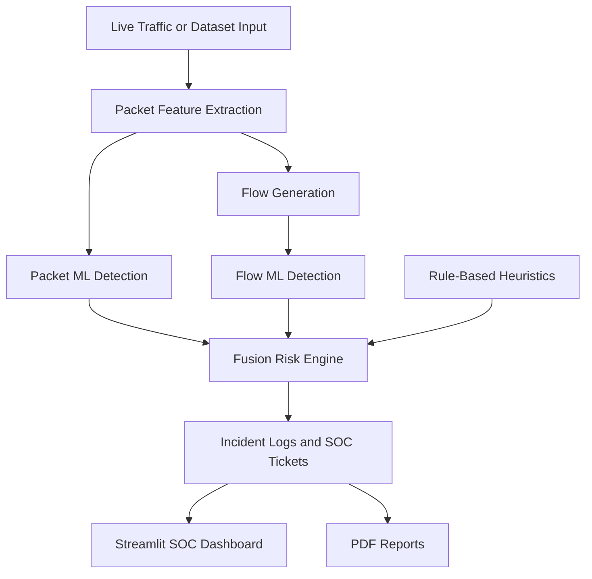

# SentinelIDS

SentinelIDS is a machine learning based Intrusion Detection System (IDS) for IoT and lab network environments. It combines packet-level detection, flow-level analysis, rule-based risk scoring, and a Streamlit SOC dashboard to help monitor network activity, identify suspicious traffic, and generate actionable security insights.

The project is designed for academic, research, and authorized security lab use. It supports both dataset-based evaluation and live traffic monitoring in a controlled VMware lab.

## Repository Description

Use this as the GitHub repository description:

```text
Machine learning based IoT intrusion detection system with live packet capture, flow fusion scoring, SOC dashboard, incident logging, and PDF reporting.
```

## Key Features

- Dataset-based IDS testing using pre-trained machine learning models.
- Live packet capture support for VMware VMnet lab traffic.
- Packet-level and flow-level threat detection pipeline.
- Weighted fusion scoring that combines packet ML, flow ML, and rule-based risk.
- Streamlit SOC dashboard for traffic visibility, incidents, severity trends, and reports.
- Automated SOC ticket generation with priority levels.
- PDF report generation for summarized detection results.
- Device discovery and inventory support using ARP data.
- Windows PowerShell scripts for easier setup and execution.

## System Overview



## Project Structure

```text
iot-ids-ml-dashboard/
|-- app/
|   `-- dashboard.py              # Streamlit SOC dashboard
|-- src/
|   |-- capture_live_vmnet.py     # Windows VMnet packet capture
|   |-- run_flow_soc_pipeline.py  # Flow analysis and SOC pipeline
|   |-- apply_flow_fusion.py      # Fusion scoring logic
|   |-- apply_risk_engine.py      # Risk and severity rules
|   |-- soc_ticket_generator.py   # SOC ticket generation
|   `-- generate_pdf_report.py    # PDF report generation
|-- models/                       # Pre-trained ML model files
|-- live_data/                    # Live packet capture input files
|-- logs/                         # Detection logs and incidents
|-- reports/                      # Generated reports
|-- tests/                        # Test suite
|-- requirements.txt              # Python dependencies
`-- run_dashboard.ps1             # Dashboard launch script
```

## Requirements

- Python 3.9 or newer
- Windows PowerShell for provided helper scripts
- Npcap for Windows live capture mode
- VMware Workstation or VMware Player for the single-PC lab setup
- Kali Linux VM for attack simulation
- Metasploitable VM or another intentionally vulnerable lab target

Install Python dependencies:

```powershell
python -m venv venv
.\venv\Scripts\activate
pip install -r requirements.txt
```

## Quick Start

Clone the repository:

```powershell
git clone https://github.com/vishwa-10147/SentinelIDS.git
cd SentinelIDS
```

Create and activate a virtual environment:

```powershell
python -m venv venv
.\venv\Scripts\activate
pip install -r requirements.txt
```

Start the dashboard:

```powershell
.\run_dashboard.ps1
```

Or start it manually:

```powershell
streamlit run app/dashboard.py
```

The dashboard runs locally at:

```text
http://localhost:8501
```

## Live VMware Lab Mode

SentinelIDS can monitor traffic from a VMware virtual network on the Windows host. A typical lab setup is:

- Windows host: runs SentinelIDS and the dashboard.
- Kali Linux VM: generates authorized test traffic.
- Metasploitable VM: acts as the vulnerable target.
- All systems connected to the same VMware VMnet network.

Run the one-time Windows setup from an Administrator PowerShell:

```powershell
.\setup_windows_vmnet_lab.ps1
```

Start live packet capture:

```powershell
.\start_vmnet_capture.ps1 -InterfaceHint "VMware Network Adapter VMnet1" -UseModel -AlertThreshold 0.90
```

Start the continuous SOC pipeline:

```powershell
.\start_soc_pipeline_loop.ps1 -IntervalSeconds 8
```

Start the dashboard:

```powershell
streamlit run app/dashboard.py
```

Generate authorized test traffic from Kali:

```bash
ping -c 20 <TARGET_IP>
nmap -sS -Pn <TARGET_IP>
telnet <TARGET_IP> 23
```

## Detection Pipeline

SentinelIDS processes traffic in multiple stages:

1. Packet capture or dataset input is converted into structured features.
2. Packet-level ML detection classifies individual network records.
3. Flow generation groups related packet activity.
4. Flow-level ML detection identifies suspicious behavior patterns.
5. Rule-based heuristics add risk context for known attack indicators.
6. Fusion scoring produces a final severity score for SOC review.
7. Incidents, tickets, dashboards, and reports are generated from the results.

The final flow score uses this weighting:

```text
Final Score = 0.4 * Packet ML + 0.4 * Flow ML + 0.2 * Rule Engine
```

## Important Output Files

| File | Purpose |
| --- | --- |
| `live_data/live_capture.csv` | Live packet capture input |
| `logs/live_scored_packets.csv` | Packet-level scored output |
| `logs/live_flows_final.csv` | Final flow-level fusion results |
| `logs/flow_incidents.csv` | Incident records generated by the SOC pipeline |
| `logs/soc_tickets.csv` | Generated SOC tickets |
| `reports/` | Exported PDF reports |

## Testing

Run the test suite with:

```powershell
.\run_tests.ps1
```

Or:

```powershell
python run_tests.py
```

## Documentation

Additional documentation is included in the repository:

- `QUICK_START.md` for setup and usage steps.
- `PROJECT_DOCUMENTATION.md` for technical project details.
- `DEPLOYMENT_GUIDE.md` for deployment notes.
- `TESTING_GUIDE.md` for testing guidance.
- `SECURITY_GUIDE.md` for security recommendations.
- `RUNBOOK_REALTIME_VMWARE.md` for the VMware live monitoring workflow.

## Security and Legal Notice

This project is intended only for authorized security testing, education, and research. Do not use it to monitor networks or systems without permission. Users are responsible for following applicable laws, institutional policies, and ethical security practices.

## License

This project is provided for educational and research purposes. Check the repository license file, if present, before using or distributing it in another project.
