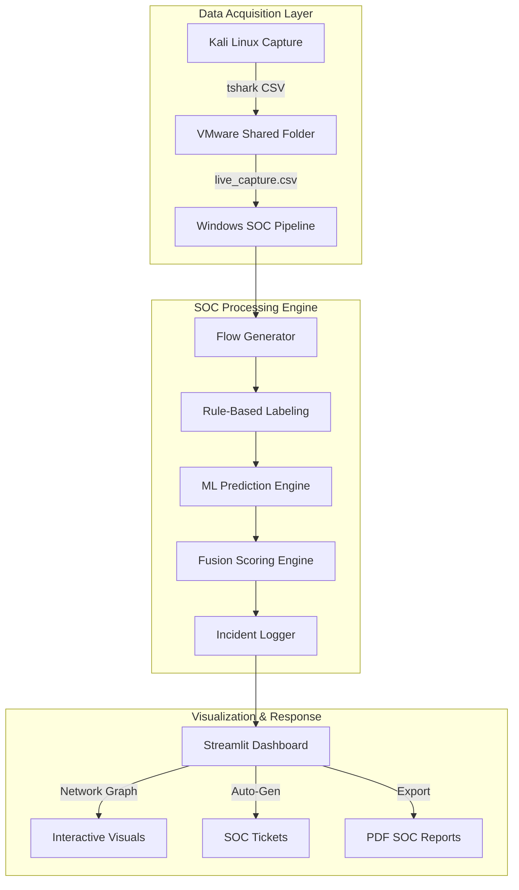

# 🛡️ IoT IDS + SOC Dashboard (Premium ML Edition)
### *A Multi-Level Machine Learning–Based Intrusion Detection System for IoT Networks*

[](https://www.python.org/)
[](https://opensource.org/licenses/MIT)
[]()
[]()

### *Advanced Real-Time Intrusion Detection & Security Operations Center (SOC) Intelligence*

This project is a high-performance **Machine Learning-driven Intrusion Detection System (IDS)** integrated with a premium **SOC-style Dashbord**. It provides comprehensive visibility into IoT network threats through real-time packet analysis, flow behavior modeling, and automated incident response orchestration.

---

## 🏗️ Architecture Overview



---

## 🚀 Key Features

### 💎 Premium SOC Dashboard
- **Interactive Network Traffic Graph**: Visualize real-time connection nodes and threat paths.
- **System Health Monitor**: Track CPU/RAM overhead of the IDS engine.
- **Global SOC Visuals**: Comprehensive charts for attack distribution and severity trends.

### 🧠 Intelligent Detection (Level 1-5)
- **Multi-Level IDS**: 
  - **Dataset Mode**: TON_IoT benchmark testing.
  - **Live Mode**: Real-time packet-level classification.
  - **Flow Mode**: Advanced behavioral analysis (Level 4/5).
- **Fusion Scoring**: Combines ML confidence with heuristic rules for high-fidelity alerts.
- **Advanced Attack Labeling**: Specialized rules for Bruteforce, Portscan, DNS Tunneling, and more.

### 📋 Incident Management
- **Automated SOC Tickets**: Self-generating tickets with P1-P4 priority levels.
- **Ticket Lifecycle**: Full tracking (OPEN → INVESTIGATING → RESOLVED).
- **PDF Reporting**: One-click professional SOC summary report generation for compliance and audits.

---

## 📁 Project Structure

```text
iot-ids-ml-dashboard/
├── app/
│   └── dashboard.py           # Premium Streamlit SOC Dashboard
├── src/
│   ├── flow_generator.py      # Core flow engine
│   ├── soc_ticket_generator.py # Ticket automation
│   ├── generate_pdf_report.py # Professional PDF reporting
│   └── device_discovery.py    # Assets & Inventory management
├── models/
│   └── *.pkl                  # Pre-trained ML classifiers
├── logs/                      # Incident & Ticket audit trails
├── reports/                   # Generated SOC reports
└── live_data/                 # Real-time capture feed
```

---

## 🛠️ Quick Start

### 1️⃣ Prerequisites
- **Python 3.9+**
- **Wireshark/Tshark** (on Kali Linux)

### 2️⃣ Installation
```bash
# Clone the repository
git clone https://github.com/vishwa-10147/iot-ids-ml-dashboard.git
cd iot-ids-ml-dashboard

# Setup Virtual Environment
python -m venv venv
.\venv\Scripts\activate

# Install Dependencies
pip install -r requirements.txt
pip install streamlit-agraph psutil reportlab
```

### 3️⃣ Launch
```powershell
# One-click launch
.\run_dashboard.ps1
```

---

## 🌐 Live Capture Setup
For real-time monitoring, deploy the capture agent on your sensor node (Kali Linux):

```bash
sudo tshark -i eth0 -a duration:60 -T fields \
-e frame.time_epoch -e ip.src -e ip.dst -e ip.proto \
-e tcp.srcport -e tcp.dstport \
-e udp.srcport -e udp.dstport \
-e frame.len \
-E header=y -E separator=, \
> /mnt/hgfs/live_data/live_capture.csv
```

---

## 👨‍💻 Research & Development
**Author**: Vishwa (Cybersecurity Researcher)  
**Version**: 1.1.0-Premium  
**Status**: Active Research Project

### 📖 Citation
```bibtex
@software{vishwa2025iot_ids_premium,
  author = {Vishwa},
  title = {IoT IDS + SOC Dashboard: Premium ML-Based Security Operations},
  year = {2025},
  version = {1.1.0},
  url = {https://github.com/vishwa-10147/iot-ids-ml-dashboard}
}
```

---

## 📌 Acknowledgments
Special thanks to the **UNSW Sydney** for the TON_IoT dataset and the open-source community for **Streamlit** and **Scikit-learn**.

---
**⚠️ Disclaimer:** This software is provided for educational and research purposes only. Users are responsible for ensuring compliance with all applicable laws and regulations regarding network monitoring and data collection in their jurisdiction.
*Disclaimer: This tool is for authorized security research only.*
